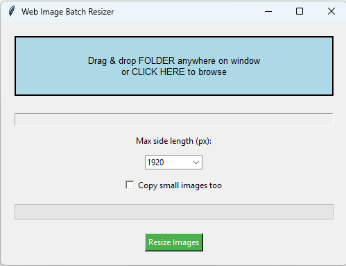

# ImageResizer - Batch Web Image Optimizer GUI

 <!-- Replace with your screenshot -->

**Drag & drop a folder → Pick web preset (1920/1200/800px) → Get optimized JPGs in `/resized/` subfolder.**

Perfect for web devs, artists, photographers. Balances quality (92% JPEG + Lanczos resampling) with ~70-90% file size reduction.

## ✨ Features
- **Drag & Drop** folders (Windows File Explorer → anywhere on app)
- **Web Presets**: 1920px (hero), 1200px (large), 800px (thumbs)
- **Smart Skip**: Images already ≤ target size (optional copy)
- **Recursive**: Scans subfolders (JPG/PNG/WEBP/TIFF/etc)
- **Progress Bar** + stats (processed/skipped/errors)
- **Aspect Ratio** preserved, RGB optimized JPEG output
- **Standalone EXE** - No Python install needed!

## 🚀 Quick Start

### Windows (EXE - Recommended)
1. Download `ImageResizer.exe` from [Releases](https://github.com/pmonk/ImageResizer/releases)
2. **Double-click icon**
3. Drag folder or click "Browse"
4. Pick size → **Resize Images**
5. **Output**: `/resized/` folder with optimized JPGs

### Python
```bash
pip install pillow tkinterdnd2
python image_resizer.py

## 📁 Example Output

📁 photos/          ← Input folder
├── IMG_001.jpg     ← 4000x3000 (7MB)
├── thumbs/         ← Subfolder scanned
│   └── small.jpg   ← Skipped (already 600px)
└── ...

📁 photos/resized/  ← Auto-created
├── IMG_001.jpg     ← 1920px max, 180KB (97% smaller!)
└── small.jpg       ← Copied if checkbox enabled

## 🛠️ Build EXE Yourself
Download image.ico + image_resizer.py

Run build_exe.bat

Get dist/ImageResizer.exe

## 🎨 Customization
self.max_sizes =   # Add sizes
'save(out_path, 'JPEG', quality=85)'      # Smaller files
'WEBP', quality=90                        # Modern format

📸 Sample Results
Original	Resized 1920px	Size Reduction
4000x3000
7.2MB	1920x1440
185KB	97%
3000x4000
5.8MB	1200x1600
112KB	98%
💻 Tech Stack
Python 3.8+ / Tkinter (built-in GUI)

Pillow - Image processing

tkinterdnd2 - Drag & drop

PyInstaller - Windows EXE

## 🤝 Credits
Icon: Windows 11 Frame icon by FadeMind/W-ICO (Public Domain) https://github.com/FadeMind/W-ICO 

tkinterdnd2: Drag-drop wrapper https://github.com/pmgagne/tkinterdnd2

Perplexity AI: Initial script generation & troubleshooting

Pillow Team: Image optimization https://pillow.readthedocs.io

## ⚖️ License
MIT License - © 2026 pmonk.com

Free for personal, commercial, whatever. No warranty. Test on copies first!
